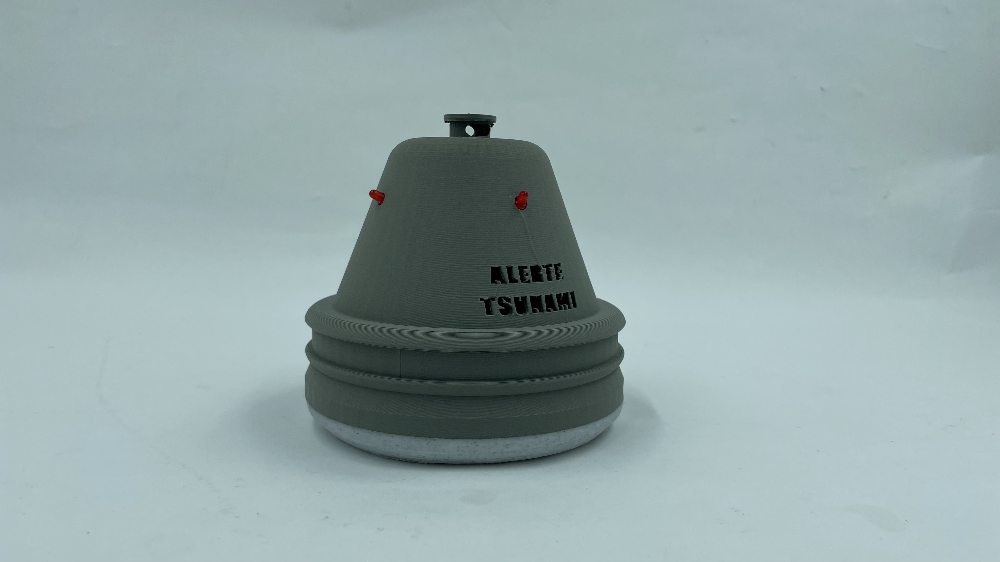

# Tsunami_Emergency_Lights

## Overview
Prototype code for the ideation of TajinAlert an emergency lighthing system to help populations evacuate dangerous areas in a timely manner in case of natural disasters such as tsunamis and earthquakes.

## Images
### Image 1

### Image 2
